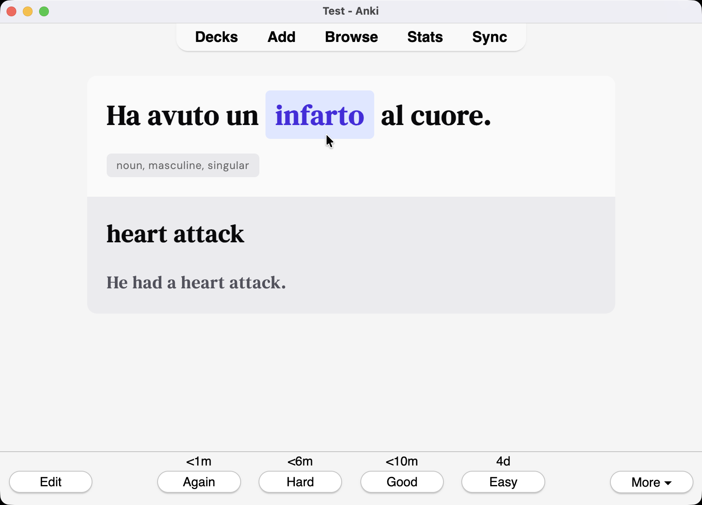

# Anki Lindkvist



Beautiful Anki card templates with example Italian vocabulary decks. This repository contains two distinct card templates:

## 📋 Overview

This repository contains:

- **Lindkvist Card Template**: Traditional cloze deletion cards with clean, modern styling
- **Brolingo Template**: Interactive multiple-choice cards with mascot and gamified learning
- **Example Decks**: Italian vocabulary decks demonstrating both templates
- **Generation Tools**: AI prompts for creating vocabulary data
- **Styling**: Modern, clean card designs that look better than default Anki

### Lindkvist Template Features:

- Cloze deletion sentences for context-based learning
- Part-of-speech tagging and grammatical information
- English translations for both words and example sentences
- Audio support for pronunciation
- Modern, natural Italian examples (CEFR A1-B2 level)

### Brolingo Template Features:

- Interactive multiple-choice learning with mascot character
- Gamified interface with choice buttons and validation
- Similar words and false words for enhanced learning
- Audio integration with visual feedback
- Engaging bubble-style speech interface

## 🗂️ Project Structure

```
card/                   # Lindkvist template
├── front.html          # Front side template
├── back.html           # Back side template
└── style.css           # Card styling

brolingo/               # Interactive brolingo template
├── card/
│   ├── front.html      # Interactive front template
│   ├── back.html       # Interactive back template
│   ├── style.css       # Brolingo-specific styling
│   ├── main.js         # Interactive JavaScript functionality
│   ├── mascot.png      # Mascot character image
│   └── mascot2.png     # Alternative mascot image
└── example/
    ├── prompt.md       # AI prompt for brolingo data generation
    └── csv/
        └── 01_basic_personal_words.csv  # Example brolingo vocabulary data

example/                # Lindkvist template examples
├── prompt.md           # AI prompt for generating vocabulary data
├── words.csv           # Example Italian vocabulary data
└── deck.apkg           # Example Anki deck file
```

## 🚀 Usage

### Using the Lindkvist Card Template

1. **Copy the template files:**

   - Copy `card/front.html`, `card/back.html`, and `card/style.css` to your Anki deck
   - Update your deck's card templates with these files

2. **Try the example deck:**
   - Import `example/words.csv` to see the template in action
   - Install [AwesomeTTS](https://ankiweb.net/shared/info/1436550454) for text-to-speech functionality

### Using the Brolingo Template

1. **Copy the brolingo template files:**

   - Copy all files from `brolingo/card/` to your Anki deck
   - Update your deck's card templates with these files
   - Ensure the JavaScript and CSS files are accessible (you may need to host them locally)

2. **Try the brolingo example deck:**
   - Import `brolingo/example/csv/01_basic_personal_words.csv` to see the interactive template
   - The template provides multiple-choice learning with a mascot character

### Creating Your Own Deck

#### For Lindkvist Template:

1. **Use the generation prompt:**
   - Copy `example/prompt.md` and modify for your target language
   - Use AI to generate vocabulary data in the specified CSV format
   - Import the generated CSV into Anki

#### For Brolingo Template:

1. **Use the brolingo generation prompt:**
   - Copy `brolingo/example/prompt.md` and modify for your target language
   - Use AI to generate vocabulary data in the brolingo CSV format
   - Import the generated CSV into Anki with the brolingo template

## 📝 Card Format

Each card contains:

- **Front:** Italian sentence with cloze deletion
- **Back:** Complete sentence with translation and grammatical information
- **Audio:** Text-to-speech pronunciation
- **Tags:** Organized by categories for easy filtering

## Creating New Content

1. **Use the generation prompt:**
   - Copy `example/prompt.md` and modify for your target language
   - Follow the CSV format specified in the prompt
   - Generate vocabulary data using AI tools
   - Import the generated CSV into Anki

## 📊 Data Format

### Lindkvist Template Format

The lindkvist template uses this CSV structure:

```
Word;ExampleSentence;WordPOS;TranslationWord;TranslationSentence
```

Where:

- `Word`: Italian lemma (base form)
- `ExampleSentence`: Italian sentence with cloze marker `{{c1::word}}`
- `WordPOS`: Part of speech with grammatical tags
- `TranslationWord`: English translation
- `TranslationSentence`: English translation of the full sentence

### Brolingo Template Format

The brolingo template uses this enhanced CSV structure:

```
Word;TranslationWord;ExampleSentence;TranslationSentence;SimilarWords;FalseWords;TranslationFalseWords;Audio
```

Where:

- `Word`: Italian lemma (base form)
- `TranslationWord`: English translation
- `ExampleSentence`: Italian sentence using the word
- `TranslationSentence`: English translation of the full sentence
- `SimilarWords`: 2 Italian words semantically related (comma-separated)
- `FalseWords`: 3-5 Italian words that might appear in the sentence but are incorrect (comma-separated)
- `TranslationFalseWords`: 3-5 English words that might appear in the translation but are incorrect (comma-separated)
- `Audio`: Audio field (usually empty, handled by Anki's audio system)

## 🎮 Brolingo Template Features

The brolingo template offers an interactive, gamified learning experience.

### Todo

- [ ] Default template
  - [x] Front
  - [ ] Back
- [ ] Multiple choice 3x template
  - [ ] Front
  - [ ] Back
- [ ] Listening exercise
  - [ ] Front
  - [ ] Back

## 📄 License

See [LICENSE.md](LICENSE.md) for license information.

---

_Happy learning! 🇮🇹_
