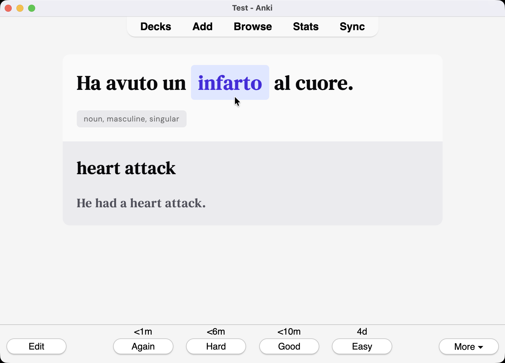

# Lindkvist Card Template

A beautiful, traditional Anki card template with cloze deletion for language learning.

## 📋 Overview

The Lindkvist template provides:

- **Cloze Deletion**: Traditional fill-in-the-blank learning
- **Clean Design**: Modern, minimalist card styling
- **Audio Support**: Text-to-speech integration
- **Context Learning**: Natural example sentences
- **Part-of-Speech**: Grammatical information and tagging

## 🗂️ Template Files

```
card/
├── front.html          # Front side template
├── back.html           # Back side template
└── style.css           # Card styling
```

## 🚀 Usage

### Setup

1. **Copy the template files:**

   - Copy `card/front.html`, `card/back.html`, and `card/style.css` to your Anki deck
   - Update your deck's card templates with these files

2. **Try the example deck:**
   - Import `example/words.csv` to see the template in action
   - Install [AwesomeTTS](https://ankiweb.net/shared/info/1436550454) for text-to-speech functionality

### Creating Your Own Deck

1. **Use the generation prompt:**
   - Copy `example/prompt.md` and modify for your target language
   - Use AI to generate vocabulary data in the specified CSV format
   - Import the generated CSV into Anki

## 📊 Data Format

The template uses this CSV structure:

```
Word;ExampleSentence;WordPOS;TranslationWord;TranslationSentence
```

Where:

- `Word`: Italian lemma (base form)
- `ExampleSentence`: Italian sentence with cloze marker `{{c1::word}}`
- `WordPOS`: Part of speech with grammatical tags
- `TranslationWord`: English translation
- `TranslationSentence`: English translation of the full sentence

## 📝 Card Format

Each card contains:

- **Front:** Italian sentence with cloze deletion
- **Back:** Complete sentence with translation and grammatical information
- **Audio:** Text-to-speech pronunciation
- **Tags:** Organized by categories for easy filtering

